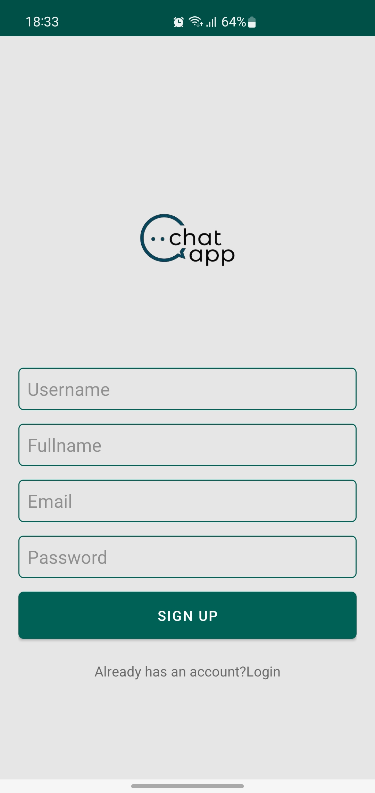
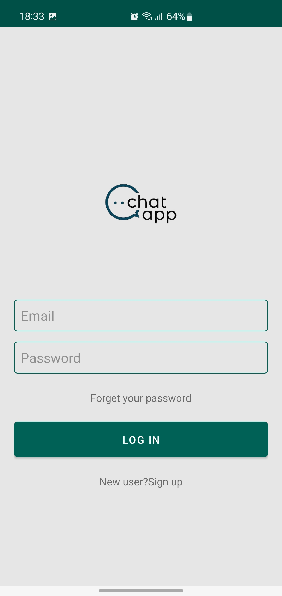
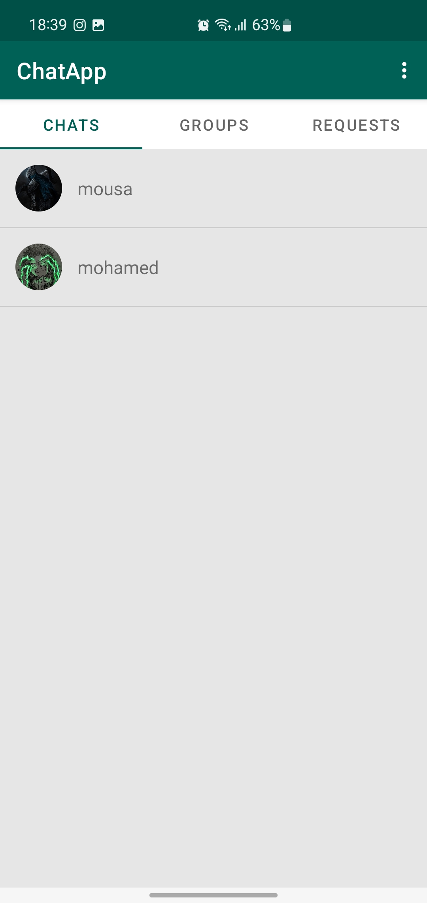
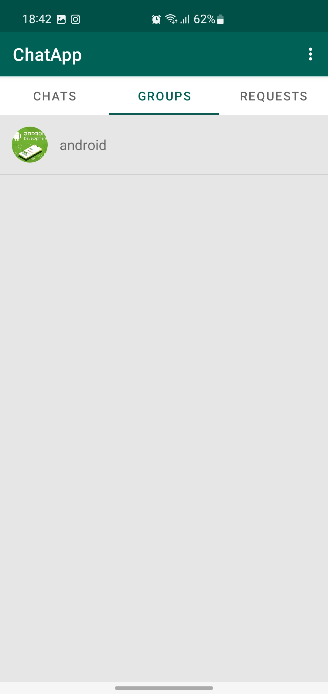
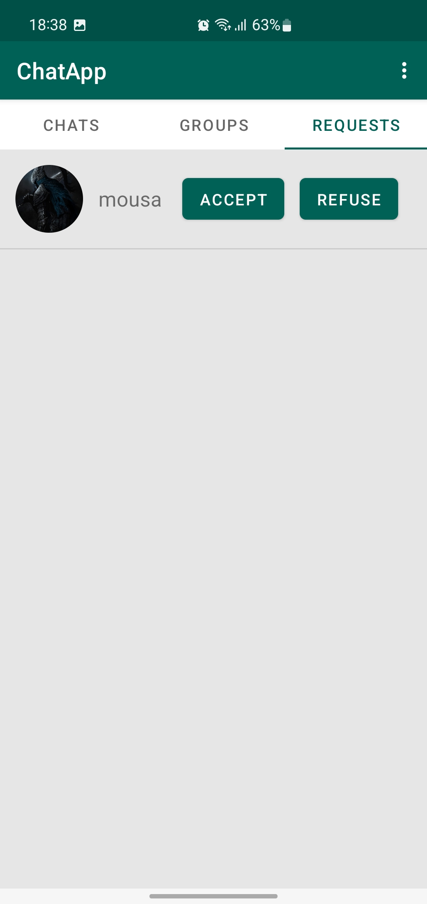
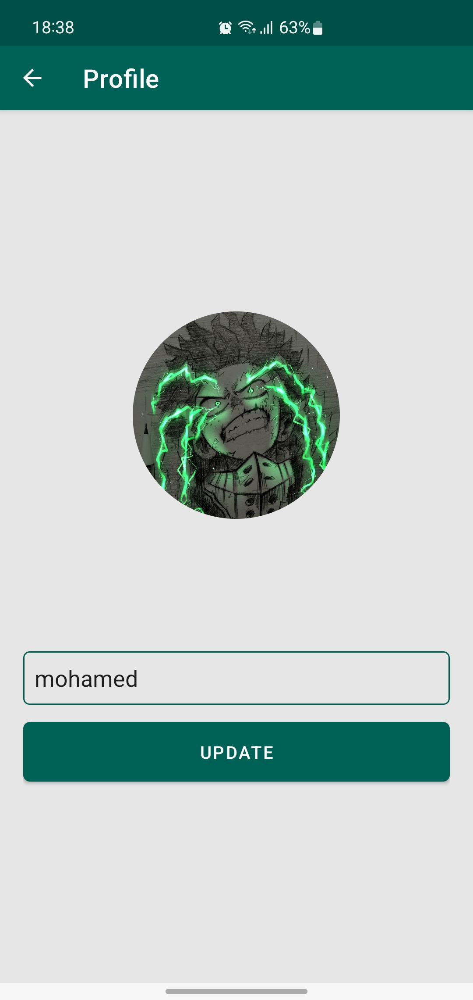
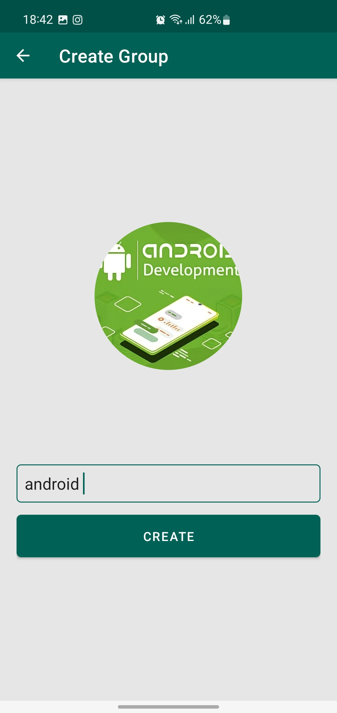
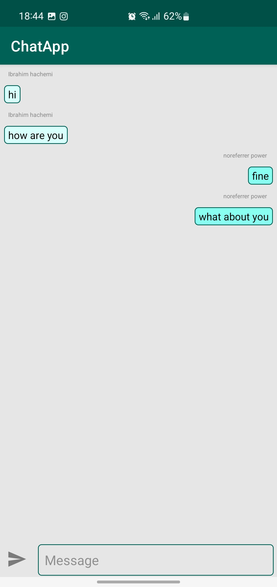

# ChatApp
 
The Chat App is a real-time messaging application designed to facilitate seamless communication between users. It provides a platform for individuals or groups to exchange messages in real-time.

<h1>Key Features</h1>

User registration and login: Users can create new accounts and log in using their credentials. 
Real-time messaging: Users can send and receive text messages in real-time with other registered users. 
Message notifications: Users receive notifications when they receive new messages. 
User presence: Users can see the online/offline status of other users. 

<h1>Technologies Used</h1>

Java: The programming language used to develop the application. 
Firebase: A cloud-based platform that provides various services including authentication and real-time database. 

<h1>Project Setup</h1>

   To get started with the project, follow these steps:
Clone the repository to your local machine. 
Open the project in Android Studio. 
Resolve Dependencies. 
Build the project. 
Run the project. 

